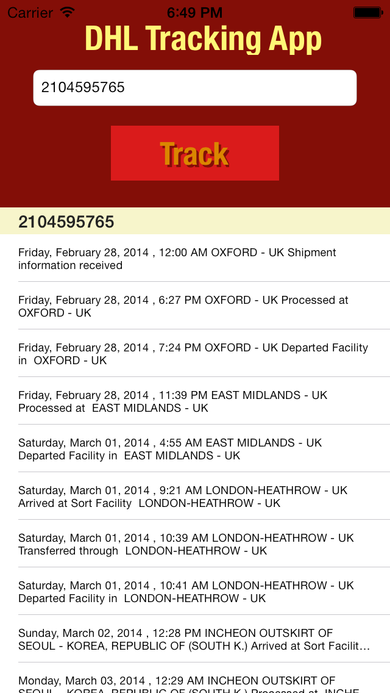

DHLTracker
==========

This is a DHL server response parser written in Objective-C. It parses tracking information for parcels by connecting to the official DHL HTML based API and parsing the response, converting it into the object model (Parcel is an object with various properties), which can be used within various tracking and business applications for iOS or even Mac OS.

Features: 
- Asynchronous Parses tracking for DHL ARC ready Tested for iOS 6/7
- Easy to implement Not a dynamic library, the actual source code Parcel data is code-value compliant, you can save your tracking data to the file storage right away.  
- Sample app includes the parser with comments on it's implementation and usage. 

Sample app is completely functional and able to list tracking information for several parcels in a table, but provided only as an example of parser implementation.  

Use sample tracking numbers to test (e.g. 2104595765, 2111111111, 9111111111).  DHL is a registered trademark and belongs to DHL International GmbH. Author of this Objective-C code is not affiliated to the DHL or any of it subsidiaries.

